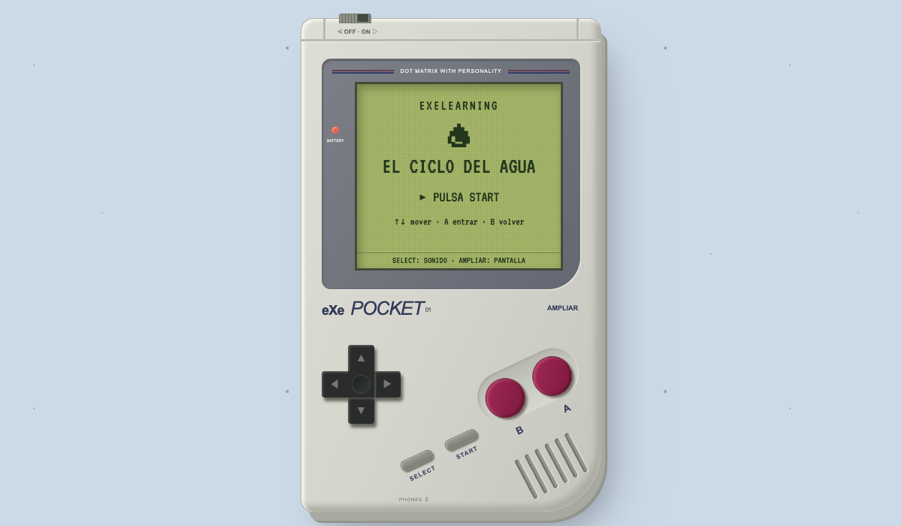

# eXeLearning Pocket

[![eXeLearning 3.0+](https://img.shields.io/badge/eXeLearning-3.0%2B-26ddc7?labelColor=1f2937&logo=data%3Aimage%2Fsvg%2Bxml%3Bbase64%2CPHN2ZyB4bWxucz0iaHR0cDovL3d3dy53My5vcmcvMjAwMC9zdmciIHZpZXdCb3g9IjAgLTAuNTE5IDYwLjE3MTUyIDYwLjE3MTUyIj4gPGcgdHJhbnNmb3JtPSJ0cmFuc2xhdGUoLTEwOS44MDIwOCwtMTIxLjE3OTE3KSI%2BIDxwYXRoIGQ9Im0gMTIwLjYzOTEyLDEyMS4xNzkxNiBjIDIuNTAyOTYsMCA1LjE3Njg0LDAuOTEwMiA4LjAyMTExLDIuNzMwNiAyLjc4NzY1LDEuNzYzNSA2LjYyNzU1LDQuODkyMzMgMTEuNTE5Nyw5LjM4NjQ0IDguNDE5MywtNy4wNTQwNiAxMi45MTAzNCwtOC42NDMwMSAxNy4yMzM2MywtOC42NDMwMSAyLjc4NzY1LDAgNS4xNzY4NCwwLjc2Nzk4IDcuMTY3ODMsMi4zMDM5NCAzLjY2NzkyLDIuODA0NzcgNC4yNzk2Myw5LjIxMDIyIDEuNzEsMTMuNDIxNTcgLTIuMDQ3ODcsMy4zNTYzNyAtNC43MjE3NSw2Ljk2ODczIC04LjAyMTExLDEwLjgzNzAxIDcuNTA5MTQsOC41MzMwOCAxMS43MDMzMiwxNC42NzMgMTEuNzAzMzIsMTguODgyNzkgMCwzLjAxNDkyIC0wLjkzODc0LDUuMzE4OTIgLTIuODE1OTYsNi45MTE3MSAtMS45MzQxMSwxLjU5Mjc5IC00LjM1MTg3LDIuMzg5MTkgLTcuMjUzMDMsMi4zODkxOSAtNC4zODA0NCwwIC0xMS4yNDg0OSwtMy4zMjM3IC0xOS43MjQ2OCwtMTAuNDM0NjQgLTQuODM1MjYsNC4yNjY0IC04LjY0Njg1LDcuMjI0NzEgLTExLjQzNDI0LDguODc0MzkgLTIuODQ0NTMsMS42NDk2NyAtNS41NDY3MiwyLjQ3NDY1IC04LjEwNjU3LDIuNDc0NjUgLTMuNDEzMjMsMCAtNi4wNTg1LC0xLjEwOTQgLTcuOTM1NzgsLTMuMzI3OTMgLTEuOTM0MTgsLTIuMjc1NjggLTIuOTAxMjYsLTQuOTQ5MyAtMi45MDEyNiwtOC4wMjExMSAwLC0xLjk5MTI2IDAuMjg0NDMsLTMuNzI2MTMgMC44NTMzMSwtNS4yMDU0MSAwLjU2ODg4LC0xLjQ3OTAzIDEuNjIxMjksLTMuMTI4NyAzLjE1NzI1LC00Ljk0OTA0IDEuNTM1OTYsLTEuODc3NDggMy45ODIxMywtNC40NjU2MyA3LjMzODQ1LC03Ljc2NTI1IC0zLjI0MjU0LC0zLjI5OTM2IC01LjYzMTgxLC01Ljk0NDcxIC03LjE2NzgsLTcuOTM1NzYgLTEuNTkyODQsLTIuMDQ3OTUgLTIuNjczNjksLTMuODM5OTIgLTMuMjQyNTcsLTUuMzc1ODggLTAuNjI1NzcsLTEuNTM1OTYgLTAuOTM4NjQsLTMuMjQyNTcgLTAuOTM4NjQsLTUuMTE5ODcgMCwtMS45OTEwNyAwLjQyNjY0LC0zLjgzOTkgMS4yNzk5NSwtNS41NDY1MSAwLjg1MzM0LC0xLjc2MzUzIDIuMTA0ODQsLTMuMTg1NzIgMy43NTQ2LC00LjI2NjU4IDEuNjQ5NzMsLTEuMDgwODcgMy41ODM5MSwtMS42MjEzIDUuODAyNDksLTEuNjIxMyB6IiBmaWxsPSIjMjZkZGM3Ii8%2BIDwvZz4gPC9zdmc%2B)](https://exelearning.net)
[](https://github.com/ateeducacion/exelearning-style-pocket/raw/refs/heads/main/content/resources/pocket.zip)
[![Edit in eXeLearning](https://img.shields.io/badge/Edit%20in-eXeLearning-26ddc7?labelColor=1f2937&logo=data%3Aimage%2Fsvg%2Bxml%3Bbase64%2CPHN2ZyB4bWxucz0iaHR0cDovL3d3dy53My5vcmcvMjAwMC9zdmciIHZpZXdCb3g9IjAgLTAuNTE5IDYwLjE3MTUyIDYwLjE3MTUyIj4gPGcgdHJhbnNmb3JtPSJ0cmFuc2xhdGUoLTEwOS44MDIwOCwtMTIxLjE3OTE3KSI%2BIDxwYXRoIGQ9Im0gMTIwLjYzOTEyLDEyMS4xNzkxNiBjIDIuNTAyOTYsMCA1LjE3Njg0LDAuOTEwMiA4LjAyMTExLDIuNzMwNiAyLjc4NzY1LDEuNzYzNSA2LjYyNzU1LDQuODkyMzMgMTEuNTE5Nyw5LjM4NjQ0IDguNDE5MywtNy4wNTQwNiAxMi45MTAzNCwtOC42NDMwMSAxNy4yMzM2MywtOC42NDMwMSAyLjc4NzY1LDAgNS4xNzY4NCwwLjc2Nzk4IDcuMTY3ODMsMi4zMDM5NCAzLjY2NzkyLDIuODA0NzcgNC4yNzk2Myw5LjIxMDIyIDEuNzEsMTMuNDIxNTcgLTIuMDQ3ODcsMy4zNTYzNyAtNC43MjE3NSw2Ljk2ODczIC04LjAyMTExLDEwLjgzNzAxIDcuNTA5MTQsOC41MzMwOCAxMS43MDMzMiwxNC42NzMgMTEuNzAzMzIsMTguODgyNzkgMCwzLjAxNDkyIC0wLjkzODc0LDUuMzE4OTIgLTIuODE1OTYsNi45MTE3MSAtMS45MzQxMSwxLjU5Mjc5IC00LjM1MTg3LDIuMzg5MTkgLTcuMjUzMDMsMi4zODkxOSAtNC4zODA0NCwwIC0xMS4yNDg0OSwtMy4zMjM3IC0xOS43MjQ2OCwtMTAuNDM0NjQgLTQuODM1MjYsNC4yNjY0IC04LjY0Njg1LDcuMjI0NzEgLTExLjQzNDI0LDguODc0MzkgLTIuODQ0NTMsMS42NDk2NyAtNS41NDY3MiwyLjQ3NDY1IC04LjEwNjU3LDIuNDc0NjUgLTMuNDEzMjMsMCAtNi4wNTg1LC0xLjEwOTQgLTcuOTM1NzgsLTMuMzI3OTMgLTEuOTM0MTgsLTIuMjc1NjggLTIuOTAxMjYsLTQuOTQ5MyAtMi45MDEyNiwtOC4wMjExMSAwLC0xLjk5MTI2IDAuMjg0NDMsLTMuNzI2MTMgMC44NTMzMSwtNS4yMDU0MSAwLjU2ODg4LC0xLjQ3OTAzIDEuNjIxMjksLTMuMTI4NyAzLjE1NzI1LC00Ljk0OTA0IDEuNTM1OTYsLTEuODc3NDggMy45ODIxMywtNC40NjU2MyA3LjMzODQ1LC03Ljc2NTI1IC0zLjI0MjU0LC0zLjI5OTM2IC01LjYzMTgxLC01Ljk0NDcxIC03LjE2NzgsLTcuOTM1NzYgLTEuNTkyODQsLTIuMDQ3OTUgLTIuNjczNjksLTMuODM5OTIgLTMuMjQyNTcsLTUuMzc1ODggLTAuNjI1NzcsLTEuNTM1OTYgLTAuOTM4NjQsLTMuMjQyNTcgLTAuOTM4NjQsLTUuMTE5ODcgMCwtMS45OTEwNyAwLjQyNjY0LC0zLjgzOTkgMS4yNzk5NSwtNS41NDY1MSAwLjg1MzM0LC0xLjc2MzUzIDIuMTA0ODQsLTMuMTg1NzIgMy43NTQ2LC00LjI2NjU4IDEuNjQ5NzMsLTEuMDgwODcgMy41ODM5MSwtMS42MjEzIDUuODAyNDksLTEuNjIxMyB6IiBmaWxsPSIjMjZkZGM3Ii8%2BIDwvZz4gPC9zdmc%2B)](https://static.exelearning.dev/?url=https://github-proxy.exelearning.dev/?repo=ateeducacion/exelearning-style-pocket&branch=main)

Estilo de eXeLearning con una consola portátil, pantalla verde y botones funcionales.
El ejemplo incluye las 11 páginas de **El ciclo del agua**, con actividades de ordenar
las fases y verdadero/falso.



[Descargar estilo Pocket](https://github.com/ateeducacion/exelearning-style-pocket/raw/refs/heads/main/content/resources/pocket.zip) · [Abrir el ejemplo en eXeLearning](https://static.exelearning.dev/?url=https://github-proxy.exelearning.dev/?repo=ateeducacion/exelearning-style-pocket&branch=main)

Importa `pocket.zip` desde el gestor de estilos de eXeLearning 3 o posterior.
La raíz del repositorio es el ejemplo ELPX descomprimido; `theme/` contiene el estilo.
Los menús se generan desde las páginas y los iDevices de cada recurso, sin nombres
ni direcciones del ejemplo escritos en el JavaScript del tema.

## Controles

- **START**: menú de páginas.
- **↑↓**: seleccionar una opción o desplazar el contenido.
- **A / Enter**: entrar. Dentro de un iDevice, A enfoca el primer control y después lo pulsa.
- **←→** dentro del iDevice: recorrer enlaces, respuestas y botones. También puedes usar Tab.
- **B / Escape**: volver hasta la portada. Las páginas con un único iDevice se abren directamente.
- **SELECT**: activar o desactivar el sonido.
- **OFF / ON**: apagar la pantalla y volver a la portada al encender.
- **AMPLIAR**: aumentar la pantalla para leer y hacer actividades. Recupera el color de las imágenes.

Los iDevices conservan sus nodos y respuestas al entrar y salir del menú.
El teclado mantiene su comportamiento normal al escribir en un campo. Las páginas
se cargan con la navegación nativa de eXeLearning. Sin JavaScript, el contenido
sigue disponible en el formato de lectura normal.

## Vista previa y paquetes

```sh
python3 -m http.server 1314 --bind 127.0.0.1
python3 scripts/package.py
python3 scripts/check.py
```

Abre <http://localhost:1314/>. Los paquetes quedan en `dist/pocket.zip` y
`dist/ciclo-del-agua.elpx`; el ZIP del estilo también se copia a `content/resources/`
para descargarlo desde el ejemplo.

Las comprobaciones de navegador usan Chrome y el Playwright que ya incluye eXeLearning:

```sh
NODE_PATH=/ruta/a/exelearning/node_modules node scripts/check-browser.cjs
```

Comprueban las 11 páginas, los iDevices originales, los ejercicios completos,
el regreso a portada, el apagado, el contraste de selección y los tamaños móviles.
Para regenerar la miniatura, añade `POCKET_SCREENSHOT=theme/screenshot.png` al comando.

## Mantenimiento y publicación

La estructura de publicación procede de `exelearning-style-hacker`:
Actions, `.gitignore`, `.gitattributes`, licencia y notas de `git archive`.

- `python3 scripts/build_water_cycle.py`: reconstruye el ejemplo ELPX y el estilo
  desde los archivos actuales, conservando las actividades editadas.
- `python3 scripts/generate_social_preview.py`: regenera `social-preview.png`;
  necesita Pillow (`python3 -m pip install Pillow`). Adaptado del script de Hacker
  con la paleta de Pocket.
- `scripts/package.py`, `scripts/check.py` y `scripts/check-browser.cjs`:
  empaquetado y comprobaciones del recurso y la consola.

El workflow **Release** se ejecuta manualmente desde Actions o al subir una etiqueta
`v*`. Comprueba el ejemplo y genera `exelearning-style-pocket-<versión>.zip`,
`pocket.zip` y `ciclo-del-agua.elpx`. En una ejecución manual se guardan como
artefactos; con una etiqueta se adjuntan a la release.

Los generadores de iconos Tron y de imágenes de malla de Hacker son específicos
de su diseño. Pocket conserva los iconos de Spectrum y sus imágenes originales;
el efecto de pantalla se aplica con CSS.

## Colección de estilos

Estilos de eXeLearning del Área de Tecnología Educativa. Cada repositorio incluye el estilo y un recurso de ejemplo que se puede abrir directamente en eXeLearning.

<table>
  <tr>
    <td align="center" width="33%"><a href="https://github.com/ateeducacion/exelearning-style-book"><br><b>Libro</b></a><br><sub>Libro abierto con paso de página</sub></td>
    <td align="center" width="33%"><a href="https://github.com/ateeducacion/exelearning-style-pocket"><br><b>Pocket</b></a><br><sub>Consola portátil de pantalla verde</sub></td>
    <td align="center" width="33%"><a href="https://github.com/ateeducacion/exelearning-style-hacker"><br><b>Hacker</b></a><br><sub>Terminal con Matrix, Tron y PipBoy</sub></td>
  </tr>
  <tr>
    <td align="center" width="33%"><a href="https://github.com/ateeducacion/exelearning-style-spectrum128k"><br><b>Spectrum 128K</b></a><br><sub>ZX Spectrum con franjas y CRT</sub></td>
    <td align="center" width="33%"><a href="https://github.com/ateeducacion/exelearning-style-scumm"><br><b>SCUMM Adventure</b></a><br><sub>Aventura gráfica con verbos e inventario</sub></td>
    <td align="center" width="33%"><a href="https://github.com/ateeducacion/exelearning-style-boost"><br><b>Boost</b></a><br><sub>Moodle Boost con índice del curso</sub></td>
  </tr>
</table>

Los estilos oficiales para los centros educativos de Canarias (Flux, Nova y REF) están en [exelearning-styles-canarias](https://github.com/ateeducacion/exelearning-styles-canarias).

## Créditos y licencias

[Licencia general CC0](LICENSE), como en Hacker, salvo los archivos que indican
otra licencia.


Carcasa adaptada del portfolio de Ernesto Serrano; tema bajo [GPL-3.0](theme/LICENSE).
Recurso de ejemplo, ilustraciones e iconos reutilizados del estilo Spectrum 128K del
Área de Tecnología Educativa del Gobierno de Canarias, bajo CC0 1.0.
VT323, de Peter Hull, bajo [SIL OFL 1.1](theme/fonts/VT323-LICENSE.txt).
Los archivos de eXeLearning y sus bibliotecas conservan sus licencias originales.
